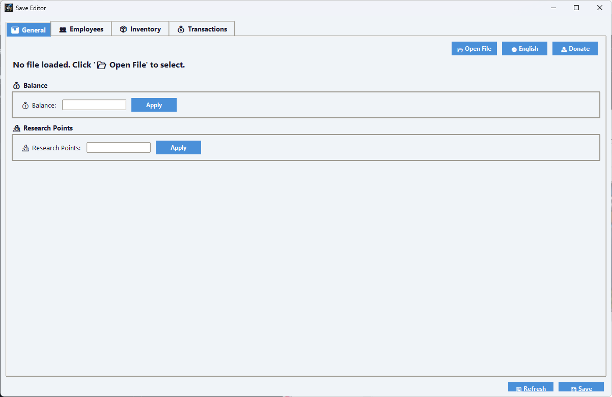
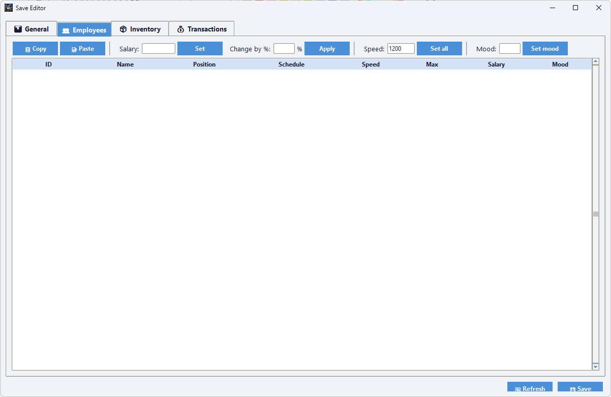

# 🎮 Startup Company Save Editor
Startup Company Save Editor – the first graphical save file editor for Startup Company. 
Edit balance, research points, employees, inventory, and more. 
No other save editor or save file editor exists for this game.
**A powerful save file editor for the game [Startup Company](https://store.steampowered.com/app/844160/Startup_Company/).**  
Modify your game progress easily – balance, research points, employees, inventory, transactions, and more.

## ✨ Features

- 💰 **Edit Balance** – change your company's money instantly.
- 🔬 **Research Points** – add or subtract research points.
- 👥 **Employee Management** – edit speed, max speed, salary, mood, and work schedule (double‑click to edit).
- 📦 **Inventory Editor** – view and modify all components (plan and warehouse quantities).
- 📊 **Transaction History** – see the last 200 transactions.
- 📋 **Copy & Paste** – use Ctrl+C / Ctrl+V to copy values between cells.
- 🌍 **7 Languages** – Russian, English, Ukrainian, French, Spanish, Korean, and Simplified Chinese.
- 🖼️ **Custom Icon** – the application window uses its own icon (not the default Tkinter logo).
- 📁 **Auto‑detect Save Folder** – the editor tries to find your `Saved Games\Startup Company` folder automatically.

## 🛠️ Build from Source (for developers)

### Requirements
- Python 3.8 or higher
- Tkinter (included with Python)

📬 Contact
Author: Drive2Code
Email: vladimirzarov60@gmail.com

